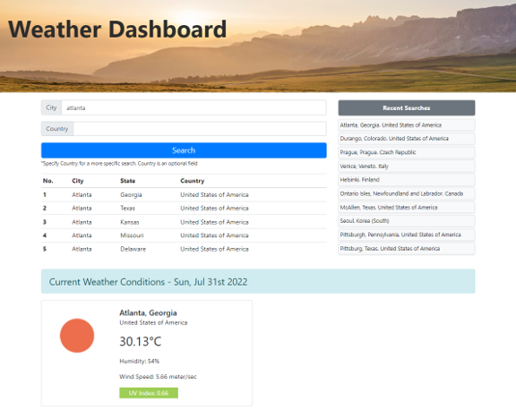
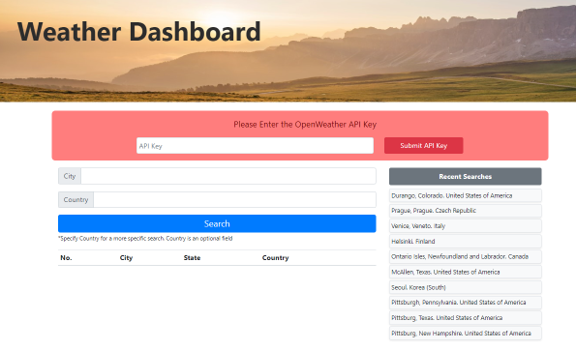

# Weather Dashboard

https://lalo79.github.io/weather-dashboard/

Weather dashboard is a simple application that allows to:

    1 Search for any City around the world. Because sometimes some places names are repeated across different places, the application lets you specify the country to narrow the search. Country Input Field has an autocomplete function to facilitate the input. The search shows 5 options that matches the input criteria.

    2 Shows Current forecast and the forecast of the next 5 days. In the info is included:
     - Temperature in Celsius
     - Humidity as %
     - Wind Speed in meters / sec
     - UV Index (Only for current forecast)

    3 The application saves the last 10 cities searched. The list shows most recent searches first. The list has a filter that avoid duplicates within the list

The appplication gets the information from the Open Weather API. Therefore, for each search, teh application makes a request using a KEY provided to each specific user.

## API KEY & SECURITY ISSUES

Given that the key is provided when requested by any specific user it became important the appropriate handling of this key. Because, the application has only frontend structure, the API will be provided separately so the user is able to enter it and start doing searches.

The application is enabled to notify when it has the key. Once entered the API key, the application stores it in the local storage, so the user can keep making searches as long as local storage is not erased.

Thanks for visiting!!

